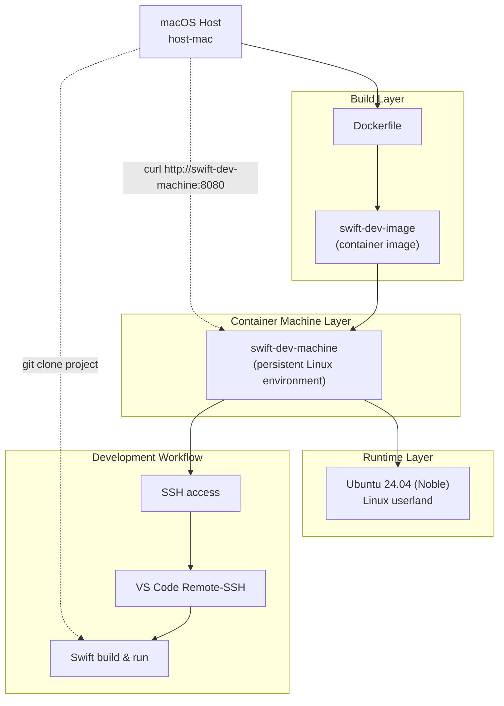

# Swift Development in Apple Container Machine

## Overview

This setup creates a persistent Linux development machine on macOS using Apple’s `container machine`.

It consists of four distinct layers:

| Layer             | Name in this README  | Purpose                       |
|-------------------|----------------------|-------------------------------|
| macOS host        | host-mac             | Your real machine             |
| container image   | swift-dev-image      | Built from Dockerfile         |
| container machine | swift-dev-machine    | Persistent Linux environment  |
| runtime OS        | Ubuntu 24.04 (Noble) | Linux userland inside machine |

---

## Key idea

A container machine behaves like a lightweight Linux server VM.

Flow:

Dockerfile → container image → container machine → SSH + VS Code remote dev

## Diagram



---

## 1. Build container image

```Shell
container build -t swift-dev-image:latest -f Dockerfile .
```

---

## 2. Create container machine

```Shell
container machine create \
  --cpus 4 \
  --memory 16G \
  --set-default \
  --name swift-dev-machine \
  swift-dev-image:latest
```

---

## 3. SSH config

```Shell
cat >> ~/.ssh/config <<EOT

Host swift-dev-machine
   HostName swift-dev-machine
   ForwardAgent yes
   UserKnownHostsFile /dev/null
EOT
```

```Shell
sudo container system dns create dns-machine
```

---

## 4. Set password

```Shell
container machine run -it sudo passwd $(whoami)
```

---

## 5. Verify

```Shell
container machine ls
ping -c 1 swift-dev-machine
```

---

## 6. VS Code

```Shell
Remote-SSH → swift-dev-machine
```

---

## 7. Clone project
On your Mac host machine, clone this repo into any folder of your choice.

```Shell
git clone https://github.com/swiftlang/swift-server-todos-tutorial.git
```

---

## 8. Build (in swift-dev-machine)
In VS Code inside the swift-dev-machine, make sure that the Swift extension is installed.

```Shell
swift build
```

---

## 9. Run (in swift-dev-machine)
Add this to `.vscode/launch.json`:

```JSON
{
  "type": "swift",
  "request": "launch",
  "name": "Launch Swift Executable",
  "program": "${workspaceRoot}/.build/debug/SwiftServerTodos",
  "args": [],
  "env": {},
  "cwd": "${workspaceRoot}"
},
```

Then run the app by clicking the play button in the Run and Debug section of VS Code.

## 10. Check (in Mac host machine)

```Shell
curl http://swift-dev-machine:8080/todos
```

You can optionally set a breakpoint in the `Telemetry.swift` file and set a breakpoint on the innermost statement of the `RequestLoggerInjectionMiddleware.respond()` function.

---

## Cleanup
```Shell
container machine stop swift-dev-machine
container machine rm swift-dev-machine
container image rm swift-dev-image:latest
sudo container system dns rm dns-machine
```

A Swift image should also have been created. If you don't plan to re-use it, you can also check its name with `container image ls` and remove it with `container image rm [name:tag]`, for instance: `container image rm swift:6.3.2-noble`.
